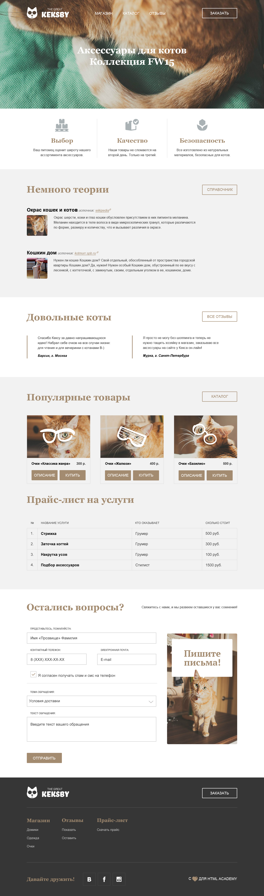

# The Great Keksby

Макет одностраничного сайта товаров и услуг для котиков. 🐈

Использовал для практики навыков вёрстки.

Посмотреть результат можно по ***[ССЫЛКЕ](https://1maximsafronov.github.io/keksby-practice-project/)***

## Детали

- Семантичная вёрстка
- Сборка с помощью Gulp
- Стили написаны на Scss
- Адаптивность отсутствует

## Превью дизайна

